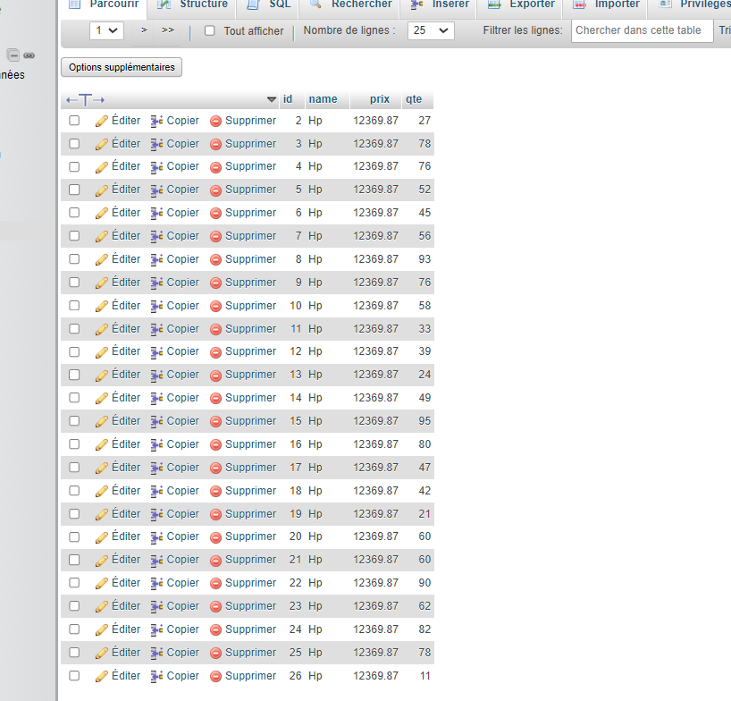

<h1>Créer l'entité JPA Product ayant les attributs </h1>

<h1> ajouter des produits </h1>

<h1> chercher des produits</h1>

<h1> ajouter 100 produits </h1>

<h1>afichage des produits avec la pagination</h1>

<h1> Migrer de H2 Database vers MySQL</h1>

